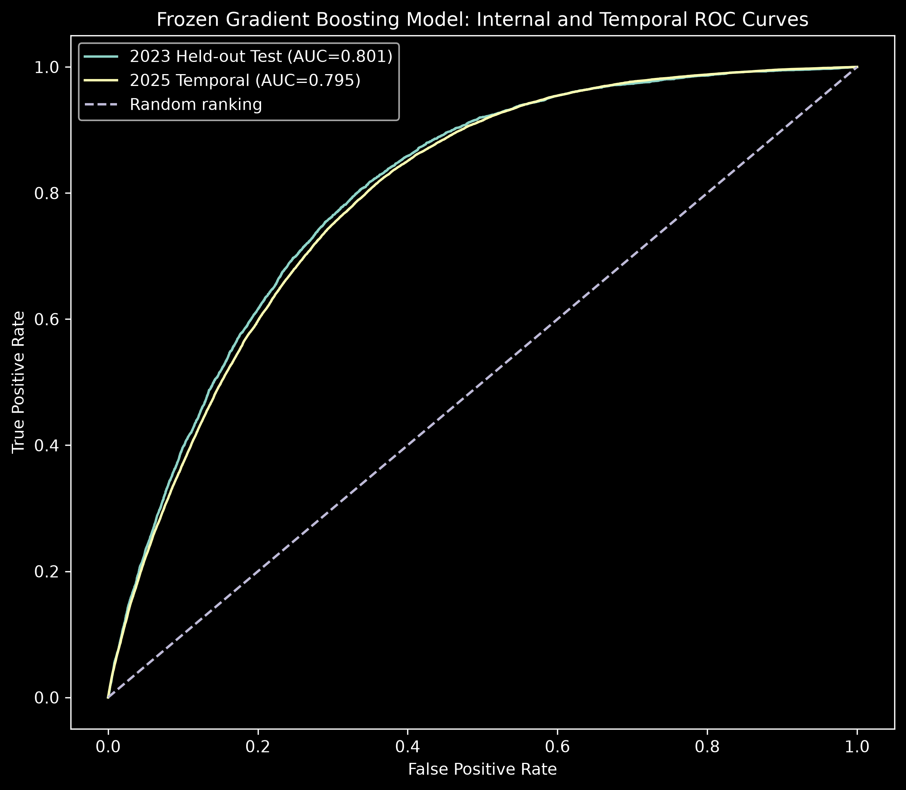
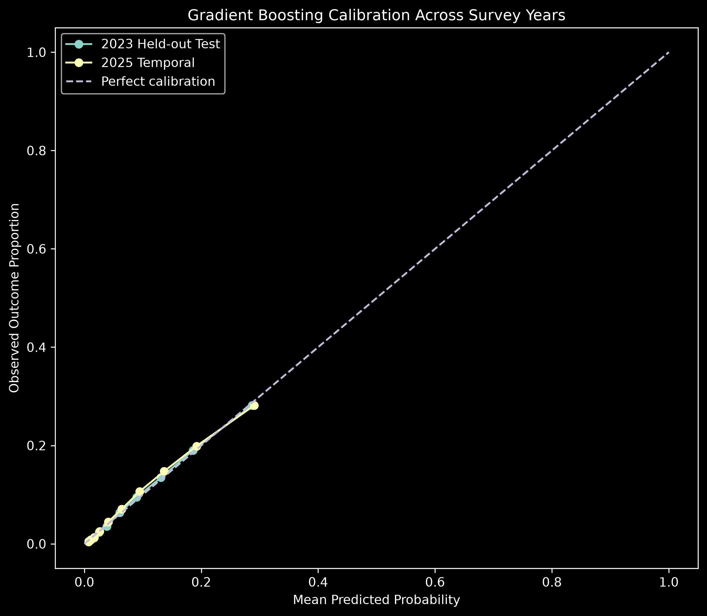
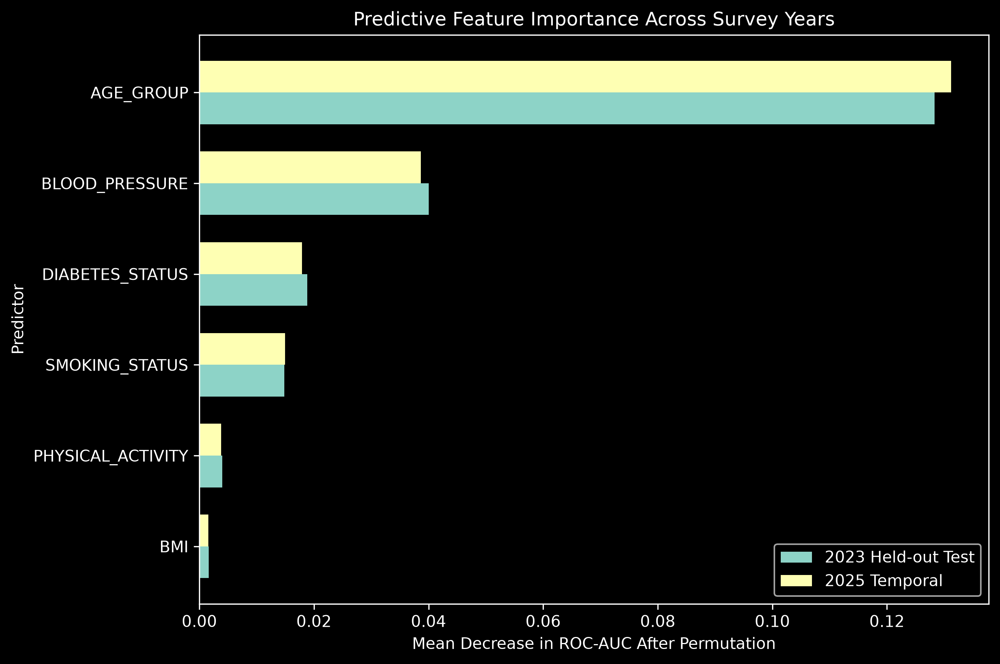

# Cardiovascular Machine Learning Research: BRFSS-Based Classification of Prevalent Self-Reported Myocardial Infarction and Coronary Heart Disease with Temporal Validation

**Research code and results · BRFSS 2023 development → BRFSS 2025 temporal evaluation**  
**Status:** Experimental analysis completed; documentation, reproducibility checks and manuscript preparation remain in progress. **No formal `v1.0.0` release or publication DOI has been issued.**

A reproducible Python study of **prevalent self-reported myocardial infarction (MI) and/or coronary heart disease (CHD)** in the U.S. Behavioral Risk Factor Surveillance System (BRFSS). The study compares classifiers, evaluates a 2023 held-out test set, and applies a **frozen 2023 model** to a separately collected BRFSS 2025 sample.

> **Scope:** Cross-sectional *classification of reported history*—**not** prediction of future cardiovascular events, clinical diagnosis, causal inference or prospective follow-up.

## Research Design

| Component | Implementation |
|---|---|
| Primary outcome | `_MICHD`, recoded to binary reported MI/CHD status |
| Development survey | BRFSS **2023**: 433,323 raw records; 428,738 known outcomes |
| Temporal evaluation | BRFSS **2025**: 356,158 raw records; 352,145 known outcomes |
| 2024 assessment | Compatibility assessment only; required `BPHIGH6` field unavailable in the required form |
| Predictors (6) | Age group, physical activity, smoking status, blood-pressure status, diabetes status, BMI |
| Internal split | 70% train / 15% validation / 15% locked test; `random_state=42` |
| Training-only tuning | 3-fold stratified CV; validation used for model choice and threshold |
| Primary model | Gradient Boosting (`n_estimators=150`, `learning_rate=0.10`, `max_depth=3`) |
| Benchmark | Tuned L2 Logistic Regression |
| Locked decision threshold | `0.152913` (approximately; selected to maximise validation F1) |

The feature matrix excludes the direct target-construction fields `CVDINFR4` and `CVDCRHD4`, as well as survey design/record metadata. Missing categorical values are represented explicitly; BMI imputation is fitted **only on the 2023 training set**. In 2025 the fitted preprocessing, model and threshold were reused with **no refitting or recalibration**.

## Key Results

**Primary frozen Gradient Boosting classifier** (unweighted metrics):

| Measure | 2023 held-out test | 2025 temporal evaluation |
|---|---:|---:|
| Records | 64,311 | 352,145 |
| Outcome prevalence | 8.47% | 9.00% |
| ROC-AUC | **0.80115** | **0.79486** |
| Average Precision (AP) | 0.24486 | 0.24877 |
| Brier score | 0.06969 | 0.07382 |
| Accuracy | 0.80695 | 0.79671 |
| Precision | 0.23399 | 0.23577 |
| Sensitivity | 0.56280 | 0.56181 |
| Specificity | 0.82954 | 0.81994 |
| F1 | 0.33055 | 0.33215 |

The ROC-AUC difference is approximately **−0.00629**. The slightly higher 2025 AP should **not** be taken as evidence of improved discrimination, because outcome prevalence also differs. The models have **not** been clinically validated.

### Candidate Model Comparison

| Classifier | Training ROC-AUC | Validation ROC-AUC |
|---|---:|---:|
| Gradient Boosting | 0.8000 | 0.8017 |
| Logistic Regression | 0.7976 | 0.8011 |
| Gaussian Naive Bayes | 0.7794 | 0.7836 |
| Random Forest | 0.9596 | 0.6830 |
| Decision Tree | 0.9684 | 0.6023 |

The large Random Forest/Decision Tree training–validation gaps illustrate why training performance alone is not evidence of generalisation. The tuned Gradient Boosting model outperformed tuned Logistic Regression only **marginally** (2025 ROC-AUC 0.79486 versus 0.79389).

### Calibration, Weighting and Robustness

| Diagnostic | 2023 held-out | 2025 temporal |
|---|---:|---:|
| Calibration slope | 1.03032 | 1.00403 |
| Calibration intercept | 0.05090 | 0.03653 |
| Mean predicted probability | 0.08510 | 0.08787 |
| Observed prevalence | 0.08468 | 0.08998 |
| Survey-weighted ROC-AUC | 0.81541 | 0.82281 |
| Survey-weighted sensitivity | 0.46954 | 0.49065 |

Survey-weighted metrics are **point estimates**, not full complex-survey confidence intervals. Additional analyses considered temporal predictor drift, missingness, age and predictor-defined subgroups, and ±20% changes to the locked threshold. Sensitivity under the fixed global threshold varied substantially across age groups.

**Held-out permutation importance** produced the same ranking in both years: **age group → blood pressure → diabetes → smoking → physical activity → BMI**. These values describe model reliance, **not causal effect or clinical importance**.

## Research Figures







The image paths above assume the exported files are present in the repository-root `artifacts/figures/` directory.

## Repository Guide

| Location | Purpose |
|---|---|
| [`notebooks/03_brfss_2023_first_look_optimised.ipynb`](notebooks/03_brfss_2023_first_look_optimised.ipynb) | Main executed experimental notebook / scientific source of truth |
| [`reports/03_brfss_2023_first_look_optimised.html`](reports/03_brfss_2023_first_look_optimised.html) | Static notebook export (refresh after final notebook review) |
| [`docs/research_protocol.md`](docs/research_protocol.md) | Implemented analysis and evaluation rules |
| [`docs/research_questions.md`](docs/research_questions.md) | Study questions and interpretation limits |
| [`docs/data_dictionary.md`](docs/data_dictionary.md) | Locked features, variable coding and survey metadata |
| [`docs/dataset_selection.md`](docs/dataset_selection.md) | 2023/2024/2025 dataset decisions |
| `artifacts/tables/` | Exported machine-readable result tables |
| `artifacts/figures/` | Generated research figures |
| `artifacts/models/` | Saved fitted pipelines (`joblib`) |
| `artifacts/provenance/` | Source fingerprints, environment and reproducibility manifest |
| `literature/` | Literature-review working files (review separately for source validity) |
| `paper/` | Manuscript work (not yet submitted/published) |

The historical [`research_log.md`](research_log.md) records the transition from early planning to the locked experimental workflow.

## Reproduce the Analysis

**1. Clone and install** (Python 3.14 was used during development; exact package versions for the executed experiment are recorded in saved provenance and should be reconciled before a full rerun):

```powershell
git clone https://github.com/imksav/cardiovascular-ml-research.git
cd cardiovascular-ml-research
python -m venv .venv
.venv\Scripts\Activate.ps1
python -m pip install -r requirements.txt
```

**2. Download CDC BRFSS annual XPT files** and place them locally (raw data are **not distributed in Git**):

```text
data/raw/brfss/2023/LLCP2023.XPT
data/raw/brfss/2024/LLCP2024.XPT  # only for 2024 compatibility checks
data/raw/brfss/2025/LLCP2025.XPT
```

**3. Start Jupyter from `notebooks/`** so that the existing dataset reads using `../data/raw/...` resolve correctly:

```powershell
cd notebooks
jupyter notebook
```

Open `03_brfss_2023_first_look_optimised.ipynb`. The **root-level artifact-directory configuration** must also be present in your local notebook before executing the export section; otherwise a working-directory-relative `Path("artifacts")` can create `notebooks/artifacts/` again. A complete rerun has **not** been established in a fresh environment as part of this documentation review. Keep the locked model/figures backed up until environment and path checks are complete.

**Reproducibility controls:** original annual XPT files kept unchanged; explicit outcome mapping and leakage checks; training-only imputation; disjoint internal splits indexed by unique row positions; fixed seed; model/threshold locks; later-year compatibility checks; serialization validation; saved dataset/model hashes and software metadata.

## Limitations

BRFSS is cross-sectional and primarily self-reported. Pre-existing MI/CHD may precede some measured predictors (possible reverse causation); the six-feature model is not a prospective cardiovascular-risk tool. Later-year testing remains **within BRFSS**, not on an unrelated clinical cohort. Model sensitivity varies across age groups and with missing predictor information. Survey weights were applied for performance **sensitivity-analysis point estimates**, without design-corrected inferential intervals for the model-performance statistics.

## Citation and Licence

The citation metadata are in [`CITATION.cff`](CITATION.cff). The repository is a **development-stage research release**, and no formal semantic-version tag or permanent DOI is claimed. When citing, use the full title above, **Keshav Bhandari**, and the [repository URL](https://github.com/imksav/cardiovascular-ml-research).

Original project code and associated materials are covered by the [MIT License](LICENSE). The underlying CDC BRFSS datasets are **not included or relicensed** by this repository; obtain them from official CDC sources.

**Author:** Keshav Bhandari · [GitHub @imksav](https://github.com/imksav)
